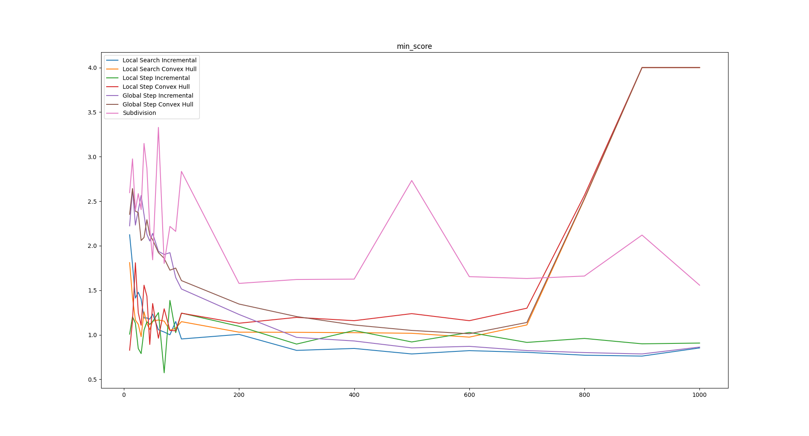
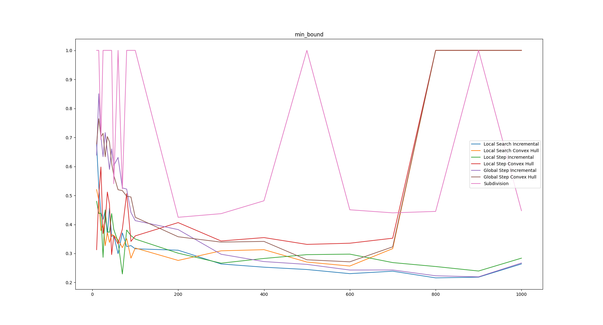
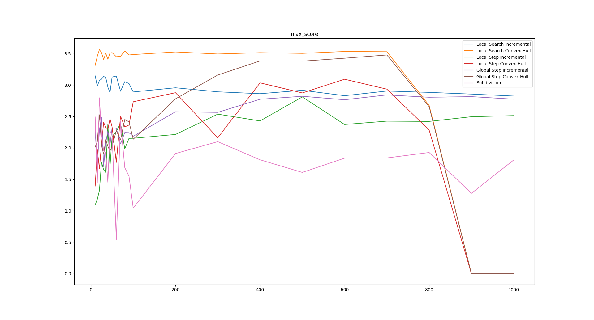
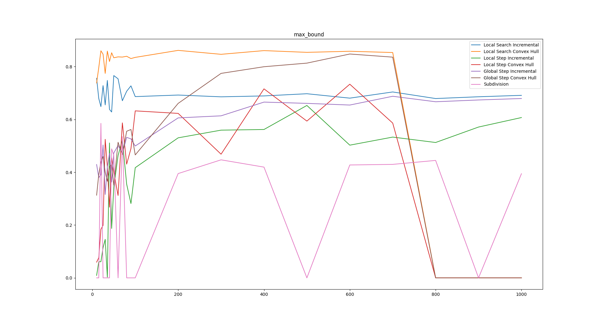

# Area Optimal Polygonisation

This is a project to implement, test and evaluate different local and global optimisation algorithms for solving the area optimal polygonisation problem, using the [CGAL](https://www.cgal.org/) library.

**This software was written collaboratively by [Nikos Alexandris](https://github.com/nikos-alexandris) and [Panagiotis Iatrou](https://github.com/PanagiotisIatrou)**.

## Algorithms implemented

### Local

- Incremental
- Convex Hull

### Global

- Local Search
- Simulated Annealing
  - Local Step
  - Global Step
  - Subdivision

## Build and Run instructions

- Minimization (the goal is to minimize y)
  
  

- Maximization (the goal is to maximize y):
  
  

## Build instructions

### Dependencies

- A standard C++ compiler with C++14 support
- [CMake](https://cmake.org/)
- [CGAL](https://www.cgal.org/)
- [Boost](https://www.boost.org/)

A Dockerfile is also provided for building the project in a container.

### Build

```shell
mkdir build
cd build
cmake .. -DCMAKE_BUILD_TYPE=Release
cmake --build .
cd ..
```

### Run

```shell
./build/evaluate -i instances/data/images -o stats.txt
```

### Visualisation of results

```shell
python scripts/mitsos.py stats.txt
```

### Docker build

```shell
docker build -t <image_name> -f Dockerfile .
docker run -it --rm <image_name>
# in docker shell now...
cd root/AreaOptimalPolygonisation/
# same steps as Build from here on...
```
